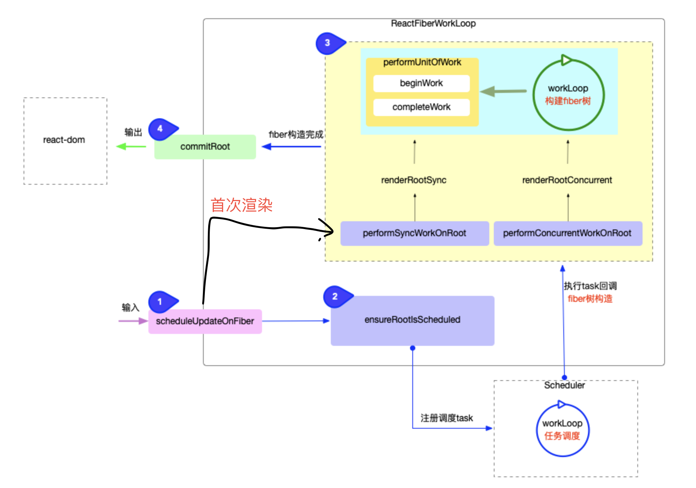

- Q: 组件如何更新？
    - A：从根节点出发，到需要更新的组件

### 知识点
- fiberNode.stateNode为真实 DOM 节点，首次渲染为null

#### reconciler 运作流程，区分首次渲染和更新

#### 渲染 DOM 的三阶段
- commitBeforeMutationEffects
    - dom 变更之前, 主要处理副作用队列中带有Snapshot,Passive标记的fiber节点.
- commitMutationEffects
    - dom 变更, 界面得到更新. 主要处理副作用队列中带有Placement, Update, Deletion, Hydrating标记的fiber节点.
- commitLayoutEffects
    - dom 变更后, 主要处理副作用队列中带有Update | Callback标记的fiber节点.